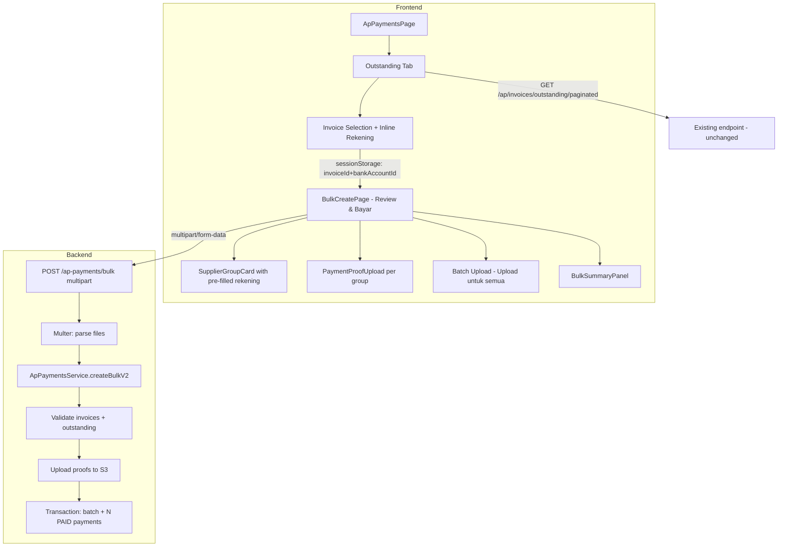
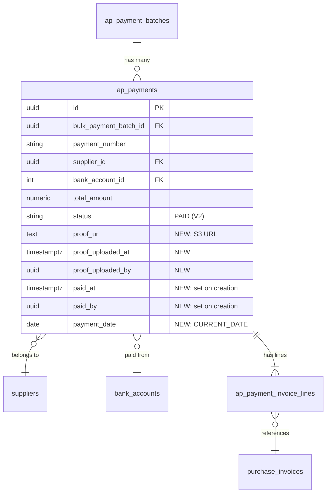

# Design Document: AP Bulk Payments V2

## Overview

This design document describes the V2 enhancements to the existing AP Bulk Payments module. V2 moves bank account selection earlier in the workflow (into the Outstanding Invoices tab), adds payment proof upload capability, and skips the draft/approval cycle — creating payments directly with PAID status.

### Key Changes from V1

| Area | V1 Behavior | V2 Behavior |
|------|-------------|-------------|
| Bank account selection | Only on Bulk Create page | Starts in Outstanding tab ("Rekening Bayar" column) |
| Session payload | `string[]` (invoice IDs only) | `{ invoiceId, bankAccountId }[]` |
| Bulk Create page title | "Buat Pembayaran Massal" | "Review & Bayar" |
| Payment status on submit | Creates DRAFT → approval flow | Creates PAID directly |
| Payment proof | Not supported | Per-group upload + "Upload untuk semua" batch option |
| Submission format | JSON POST | Multipart/form-data with files |
| Single invoice | Separate flow via `/ap-payments/new` | Uses same bulk page |

### Design Decisions

1. **Inline rekening selection in Outstanding tab** — Finance users assign payment accounts while reviewing invoices, reducing context-switching. The assignment is optional at this stage and carried forward via session payload.

2. **Backward-compatible session payload** — The Bulk Create page detects V1 format (`string[]`) and treats all bank accounts as null, ensuring no breaking change during rollout.

3. **Direct PAID status** — The rationale is that finance selecting the rekening IS the approval. This eliminates the DRAFT → PENDING_APPROVAL → APPROVED → PAID cycle for bulk payments only. Single payment creation retains the existing workflow.

4. **Proof file resolution: individual overrides batch** — When "Upload untuk semua" is used, it applies to groups without individual proof. Individual uploads always take precedence, giving users fine-grained control.

5. **Multipart/form-data submission** — Required to send proof files alongside the payment payload in a single request. The JSON payload is sent in a `payload` field, and proof files are sent as indexed file fields.

6. **Unified single/multi invoice flow** — Even 1 invoice goes through the bulk page, providing a consistent UX and simplifying the codebase.

## Architecture



### Data Flow (V2)

1. **Outstanding Tab** → User checks invoices + optionally selects rekening per row
2. **Session Storage** → `{ invoiceId, bankAccountId | null }[]` stored on "Proses Pembayaran" click
3. **Bulk Create Page** → Reads session payload → Pre-fills bank account selectors
4. **Proof Upload** → User uploads proof per payment group or uses "Upload untuk semua"
5. **Submission** → Multipart POST with JSON payload + proof files
6. **Backend** → Validates → Uploads proofs to S3 → Creates batch + PAID payments in single transaction

## Components and Interfaces

### Frontend Components — Modified

#### 1. `OutstandingInvoicesTab` (modified)

**Change:** Add "Rekening Bayar" column after "Status" column with inline `BankAccountSelector` per row.

```typescript
// New state additions to OutstandingInvoicesTab
const [bankAccountAssignments, setBankAccountAssignments] = useState<Map<string, number | null>>(new Map())

// New column in table header (after Status)
// <th>Rekening Bayar</th>

// Per-row: BankAccountSelector dropdown
// - disabled when row checkbox is unchecked
// - enabled when row checkbox is checked
// - resets to null when row is unchecked
```

**Props unchanged** — still receives `filters` from parent.

**New dependency:** `useCompanyBankAccounts` hook (same instance used on Bulk Create page).

#### 2. `BulkSelectionBar` (modified)

**Change:** Pass `{ invoiceId, bankAccountId }[]` instead of `string[]` to sessionStorage.

```typescript
interface BulkSelectionBarProps {
  selectedIds: Set<string>
  totalRemainingAmount: number
  onClearSelection: () => void
  bankAccountAssignments: Map<string, number | null>  // NEW
}

// handleProcessPayment changes:
const handleProcessPayment = () => {
  const payload: SessionPayloadItem[] = Array.from(selectedIds).map(id => ({
    invoiceId: id,
    bankAccountId: bankAccountAssignments.get(id) ?? null,
  }))
  sessionStorage.setItem('bulk_selected_invoices', JSON.stringify(payload))
  navigate('/finance/ap-payments/bulk-create')
}
```

#### 3. `BulkCreatePage` (modified)

**Changes:**
- Title: "Review & Bayar" instead of "Buat Pembayaran Massal"
- Session payload parsing: handle `{ invoiceId, bankAccountId }[]` format + V1 backward compat
- Add `PaymentProofUpload` per payment group
- Add "Upload untuk semua" batch upload area
- Confirmation dialog text: "Pembayaran akan langsung dibuat dengan status PAID"
- Submission: multipart/form-data instead of JSON POST
- Success toast: "X pembayaran berhasil dibuat sebagai PAID (Batch #YYYY)"

```typescript
// Session payload parsing (backward compatible)
function getStoredSessionPayload(): SessionPayloadItem[] | null {
  try {
    const raw = sessionStorage.getItem('bulk_selected_invoices')
    if (!raw) return null
    const parsed = JSON.parse(raw)
    if (!Array.isArray(parsed) || parsed.length === 0) return null

    // V2 format: array of objects
    if (typeof parsed[0] === 'object' && 'invoiceId' in parsed[0]) {
      return parsed as SessionPayloadItem[]
    }
    // V1 format: array of strings (backward compat)
    if (typeof parsed[0] === 'string') {
      return (parsed as string[]).map(id => ({ invoiceId: id, bankAccountId: null }))
    }
    return null
  } catch {
    return null
  }
}
```

#### 4. `useBulkCreateState` hook (modified)

**Change:** Accept initial bank account assignments from session payload.

```typescript
// Modified initializeState to accept pre-filled bankAccountIds
function initializeState(
  invoiceRows: OutstandingInvoiceRow[],
  initialAssignments: Map<string, number | null>,
  validBankAccountIds: Set<number>,
): BulkCreateState {
  const invoices = new Map<string, InvoiceAssignment>()

  for (const row of invoiceRows) {
    const prefilledBankId = initialAssignments.get(row.id) ?? null
    // Validate that pre-filled bankAccountId exists in active accounts
    const validatedBankId = prefilledBankId && validBankAccountIds.has(prefilledBankId)
      ? prefilledBankId
      : null

    invoices.set(row.id, {
      invoiceId: row.id,
      supplierId: row.supplier_id,
      supplierName: row.supplier_name,
      invoiceNumber: row.invoice_number,
      remainingAmount: row.remaining_amount,
      dueDate: row.due_date,
      checked: true,
      bankAccountId: validatedBankId,
    })
  }

  return { invoices, groupNotes: new Map() }
}
```

### Frontend Components — New

#### 5. `PaymentProofUpload` (new component)

```typescript
interface PaymentProofUploadProps {
  groupIndex: number          // index in the payment groups array
  file: File | null           // currently uploaded file (individual)
  batchFile: File | null      // batch-level file (from "Upload untuk semua")
  onFileChange: (file: File | null) => void
  error: string | null        // validation error message
}
```

**Behavior:**
- Accepts: image/jpeg, image/png, image/webp, image/heic, image/heif, application/pdf (max 10MB)
- Image files: show preview thumbnail (max 120px height)
- PDF files: show filename + file size
- Remove button to clear uploaded file
- Shows batch file info if no individual file and batch file exists
- Inline error message for invalid files

#### 6. `BatchProofUpload` (new component)

```typescript
interface BatchProofUploadProps {
  file: File | null
  onFileChange: (file: File | null) => void
  error: string | null
}
```

**Behavior:**
- Single file upload area above the payment group list
- Label: "Upload untuk semua"
- Same file validation rules as individual upload
- When file is set, it applies to all groups without individual proof

### Frontend Types — New

```typescript
// Session payload item (V2 format)
interface SessionPayloadItem {
  invoiceId: string
  bankAccountId: number | null
}

// Proof file state
interface ProofFileState {
  individualFiles: Map<number, File>  // groupIndex → File
  batchFile: File | null
}

// Resolved proof for submission
interface ResolvedProof {
  groupIndex: number
  file: File
  source: 'individual' | 'batch'
}
```

### Frontend Submission — Multipart/form-data

```typescript
// Build FormData for submission
function buildBulkPaymentFormData(
  payload: BulkCreateApPaymentDto,
  proofState: ProofFileState,
): FormData {
  const formData = new FormData()
  formData.append('payload', JSON.stringify(payload))

  // Resolve proof files: individual overrides batch
  for (let i = 0; i < payload.payments.length; i++) {
    const individualFile = proofState.individualFiles.get(i)
    const fileToUse = individualFile ?? proofState.batchFile

    if (fileToUse) {
      formData.append(`proof_${i}`, fileToUse)
    }
  }

  return formData
}

// Updated mutation hook
export const useCreateBulkPaymentV2 = () => {
  const qc = useQueryClient()
  return useMutation({
    mutationFn: async (formData: FormData) => {
      const { data } = await api.post('/ap-payments/bulk', formData, {
        headers: { 'Content-Type': 'multipart/form-data' },
        timeout: 30000,
      })
      return data.data as BulkCreateApPaymentResponse
    },
    onSuccess: () => {
      qc.invalidateQueries({ queryKey: ['ap-payments'] })
    },
  })
}
```

### Backend Interfaces — Modified

#### Modified Route: `POST /ap-payments/bulk`

**Change:** Accept multipart/form-data instead of JSON body.

```typescript
// Route change: add multer middleware for multiple files
import { documentUpload } from '../../middleware/upload-document.middleware'

router.post(
  '/bulk',
  canInsert(MODULE),
  requireWriteAccess,
  documentUpload.fields([
    { name: 'proof_0', maxCount: 1 },
    { name: 'proof_1', maxCount: 1 },
    // ... up to proof_49 (max 50 payment groups)
    // Alternatively: use dynamic field parsing
  ]),
  (req, res) => apPaymentsController.createBulk(req, res),
)
```

**Alternative approach (recommended):** Use `multer.any()` with field name validation in the controller:

```typescript
router.post(
  '/bulk',
  canInsert(MODULE),
  requireWriteAccess,
  documentUpload.any(),  // Accept any file fields
  (req, res) => apPaymentsController.createBulk(req, res),
)
```

#### Modified Controller: `createBulk`

```typescript
async createBulk(req: Request, res: Response) {
  try {
    const { company_id, branch_id } = req.branchContext
    const userId = req.user.id

    // Parse JSON payload from multipart field
    const payloadRaw = req.body.payload
    if (!payloadRaw || typeof payloadRaw !== 'string') {
      return sendError(res, 400, 'Missing payload field')
    }

    const dto: BulkCreateApPaymentDto = JSON.parse(payloadRaw)
    // Validate dto with Zod schema

    // Extract proof files by field name pattern: proof_0, proof_1, ...
    const files = (req.files as Express.Multer.File[]) ?? []
    const proofFileMap = new Map<number, Express.Multer.File>()
    for (const file of files) {
      const match = file.fieldname.match(/^proof_(\d+)$/)
      if (match) {
        proofFileMap.set(parseInt(match[1], 10), file)
      }
    }

    const result = await apPaymentsService.createBulkV2(
      dto, proofFileMap, company_id, branch_id, userId,
    )
    sendSuccess(res, result, 'Bulk payments created', 201)
  } catch (err) {
    handleError(res, err)
  }
}
```

#### Modified Service: `createBulkV2`

```typescript
async createBulkV2(
  dto: BulkCreateApPaymentDto,
  proofFiles: Map<number, Express.Multer.File>,
  companyId: string,
  contextBranchId: string,
  userId: string,
): Promise<BulkCreateApPaymentResponse> {
  // 1. Validate payments array not empty (same as V1)
  // 2. Collect all invoice IDs (same as V1)
  // 3. Execute within single transaction:
  //    a. Validate invoices exist + eligible (same as V1)
  //    b. Validate outstanding amounts (same as V1)
  //    c. Upload proof files to S3 (NEW)
  //    d. Create batch record (same as V1)
  //    e. Create payments with status=PAID, paid_at=now(), paid_by=userId (CHANGED)
  //    f. Set proof_url, proof_uploaded_at, proof_uploaded_by on payments with proof (NEW)
  //    g. If any S3 upload fails → throw → transaction rolls back (NEW)
}
```

## Data Models

### Modified Table: `ap_payments` — New Columns

```sql
-- V2 adds proof-related columns (if not already present from V1 proof upload feature)
-- These columns already exist from the single-payment proof upload feature:
--   proof_url TEXT
--   proof_uploaded_at TIMESTAMPTZ
--   proof_uploaded_by UUID REFERENCES auth_users(id)

-- V2 changes to createBulk behavior:
-- status = 'PAID' (instead of 'DRAFT')
-- paid_at = NOW()
-- paid_by = userId
-- payment_date = CURRENT_DATE
-- requested_by, requested_at, approved_by, approved_at = NULL
```

### No New Tables Required

V2 reuses the existing schema from V1:
- `ap_payment_batches` — batch record (unchanged)
- `ap_payments` — individual payment records (status changes to PAID)
- `ap_payment_invoice_lines` — line items (unchanged)

### Session Payload Schema (Frontend)

```typescript
// V2 format
type SessionPayloadV2 = Array<{
  invoiceId: string       // UUID
  bankAccountId: number | null  // company bank account ID or null
}>

// V1 format (backward compat)
type SessionPayloadV1 = string[]  // array of invoice UUIDs
```

### Entity Relationships (unchanged from V1)



## Correctness Properties

*A property is a characteristic or behavior that should hold true across all valid executions of a system — essentially, a formal statement about what the system should do. Properties serve as the bridge between human-readable specifications and machine-verifiable correctness guarantees.*

### Property 1: Dropdown enabled iff checkbox checked

*For any* invoice row in the Outstanding Invoices tab, the "Rekening Bayar" dropdown SHALL be enabled if and only if the row's checkbox is checked. When the checkbox is unchecked, the dropdown SHALL be disabled.

**Validates: Requirements 1.2, 1.3**

### Property 2: Uncheck resets bank account to null

*For any* invoice row that has a bank account selected, unchecking the row's checkbox SHALL reset the bank account assignment to null. The resulting state SHALL have `bankAccountId = null` for that invoice.

**Validates: Requirements 1.4**

### Property 3: Session payload serialization round-trip

*For any* set of checked invoices with their bank account assignments (some null, some non-null), serializing to sessionStorage as `{ invoiceId, bankAccountId }[]` and then parsing on the Bulk Create page SHALL produce the same set of invoice IDs with matching bank account values for all entries where the bankAccountId exists in the active company bank accounts list.

**Validates: Requirements 1.8, 2.1, 2.2, 2.3**

### Property 4: Invalid bankAccountId fallback to null

*For any* session payload entry where the `bankAccountId` value does not exist in the set of active company bank account IDs returned by the API, the Bulk Create page SHALL treat that entry's bank account assignment as null (unselected).

**Validates: Requirements 2.4, 3.6**

### Property 5: Stale invoice exclusion

*For any* session payload containing invoice IDs, if an invoiceId does not appear in the outstanding invoices returned by the API, that invoice SHALL be excluded from the Bulk Create form. The resulting form SHALL contain only invoices present in both the session payload and the API response.

**Validates: Requirements 2.7**

### Property 6: Supplier grouping completeness

*For any* set of invoices on the Bulk Create page, grouping by `supplier_id` SHALL produce groups where the union of all invoices across all groups equals the original set, with no duplicates and no omissions, sorted alphabetically by supplier name.

**Validates: Requirements 3.2**

### Property 7: Submission payload reflects latest state

*For any* set of invoice assignments where the user has overridden pre-filled bank accounts, the submission payload SHALL use the latest (overridden) bank account value for each invoice. The payload SHALL group invoices into payment objects by unique `(supplier_id, bank_account_id)` pairs, where each payment's `total_amount` equals the sum of its invoice line `amount_paid` values.

**Validates: Requirements 3.4, 7.4, 7.5**

### Property 8: Upload area count equals payment group count

*For any* set of checked invoices with bank accounts assigned, the number of `PaymentProofUpload` areas rendered SHALL equal the number of distinct `(supplier_id, bank_account_id)` combinations (i.e., the payment group count).

**Validates: Requirements 4.1**

### Property 9: File validation rules

*For any* file submitted as payment proof, the system SHALL accept the file if and only if its MIME type is one of (image/jpeg, image/png, image/webp, image/heic, image/heif, application/pdf) AND its size is ≤ 10MB. Files failing either condition SHALL be rejected with an appropriate error message.

**Validates: Requirements 4.2, 8.1, 8.9**

### Property 10: Proof file resolution (individual overrides batch)

*For any* set of payment groups where both a batch-level proof file and individual proof files exist, the resolved proof for each group SHALL be: the individual file if one was uploaded for that group, otherwise the batch file. Groups with neither individual nor batch proof SHALL have no proof file in the submission.

**Validates: Requirements 4.9, 4.10, 8.4**

### Property 11: Direct PAID status creation

*For any* valid bulk payment submission, every created `ap_payments` record SHALL have: `status = 'PAID'`, `paid_at` set to the current timestamp, `paid_by` set to the submitting user's ID, `payment_date` set to the current server date, and all approval-related fields (`requested_by`, `requested_at`, `approved_by`, `approved_at`) set to NULL.

**Validates: Requirements 5.1, 5.2, 5.3, 8.2**

### Property 12: Outstanding amount correctly reduced

*For any* invoice with a PAID payment created via bulk submission, the computed remaining amount (total_amount minus sum of amount_paid from all PAID/RECONCILED payment lines) SHALL be reduced by exactly the amount_paid specified in the bulk submission line for that invoice.

**Validates: Requirements 5.4**

### Property 13: Overpayment rejection

*For any* bulk payment submission where any invoice line's `amount_paid` exceeds the invoice's computed remaining amount (with tolerance of 0.01), the backend SHALL reject the entire submission with error code `AP_BULK_OUTSTANDING_EXCEEDED`, create zero records, and return the list of violating invoice IDs.

**Validates: Requirements 5.5, 8.6, 8.7**

### Property 14: Transaction atomicity

*For any* bulk payment submission, the backend SHALL create exactly 1 `ap_payment_batches` record and N `ap_payments` records (where N = number of payment groups, max 50) within a single database transaction. If any step fails (validation, S3 upload, or database error), zero records SHALL be persisted.

**Validates: Requirements 5.8, 8.5**

## Error Handling

### Frontend Errors

| Scenario | Handling |
|----------|----------|
| Bank accounts API fails (Outstanding tab) | Inline error in "Rekening Bayar" column header, all dropdowns disabled |
| Bank accounts loading (Outstanding tab) | Dropdowns show loading/disabled state until data arrives |
| Session payload absent/empty/unparseable | Redirect to `/finance/ap-payments` |
| Session payload V1 format detected | Treat all bankAccountIds as null, proceed normally |
| Invalid bankAccountId in session payload | Treat as null, require manual selection |
| Invoice from payload not in API response | Silently exclude from form |
| Proof file invalid MIME type | Inline error below upload area, file rejected, other files retained |
| Proof file exceeds 10MB | Inline error below upload area, file rejected |
| Validation — missing bank account | Highlight row with `border-red-300 bg-red-50/50`, scroll to first error |
| Submission — network error/timeout (30s) | Error toast "Koneksi gagal", retain form state + uploaded files |
| Submission — backend validation error (400) | Error toast with backend message, retain form state + uploaded files |
| Submission — S3 upload failure (500) | Error toast indicating file upload failure, retain form state |

### Backend Errors

| Scenario | HTTP Status | Error Code |
|----------|-------------|------------|
| Missing `payload` field in multipart | 400 | `VALIDATION_ERROR` |
| Invalid JSON in `payload` field | 400 | `VALIDATION_ERROR` |
| Empty payments array | 400 | `AP_BULK_EMPTY_PAYMENTS` |
| Invoice not found | 400 | `AP_BULK_INVOICE_NOT_FOUND` |
| Invoice not eligible (wrong status) | 400 | `AP_BULK_INVOICE_NOT_ELIGIBLE` |
| Outstanding amount exceeded | 400 | `AP_BULK_OUTSTANDING_EXCEEDED` |
| File exceeds 10MB | 400 | `FILE_TOO_LARGE` |
| File invalid MIME type | 400 | `FILE_INVALID_TYPE` |
| S3 upload failure | 500 | `PROOF_UPLOAD_FAILED` |
| Transaction/DB failure | 500 | `INTERNAL_ERROR` |

### New Error Classes

```typescript
// backend/src/modules/ap-payments/ap-payments.errors.ts (additions for V2)
class ApBulkProofUploadFailedError extends AppError {
  constructor(public fileIndex: number, public originalError: Error) {
    super(`Proof file upload failed for payment group ${fileIndex}`, 500)
  }
}
```

## Testing Strategy

### Unit Tests (Example-Based)

- **Session payload parsing**: V1 format (string[]), V2 format (object[]), empty, null, invalid JSON
- **Backward compatibility**: V1 payload → all bankAccountIds null
- **Page title**: Verify "Review & Bayar" renders
- **Confirmation dialog text**: Verify PAID status messaging
- **Success toast format**: Verify "X pembayaran berhasil dibuat sebagai PAID (Batch #YYYY)"
- **Single invoice flow**: 1 invoice renders correctly with submit enabled
- **Permission gating**: Balance visibility with/without `view_balance` permission
- **Proof file preview**: Image thumbnail vs PDF filename display
- **Proof file removal**: Clear button restores empty state

### Property-Based Tests

Property-based testing is appropriate for this feature because it involves:
- State management logic with universal invariants (dropdown enabled/disabled, bank account reset)
- Serialization/deserialization of session payloads (round-trip)
- Grouping and aggregation logic (supplier groups, payment groups, proof resolution)
- Validation logic that should hold across all inputs (file validation, overpayment check)

**Library**: `fast-check`

**Configuration**: Minimum 100 iterations per property test.

Each property test references its design document property:
- **Feature: ap-bulk-payments-v2, Property 1**: Dropdown enabled iff checked
- **Feature: ap-bulk-payments-v2, Property 2**: Uncheck resets bank account
- **Feature: ap-bulk-payments-v2, Property 3**: Session payload round-trip
- **Feature: ap-bulk-payments-v2, Property 4**: Invalid bankAccountId fallback
- **Feature: ap-bulk-payments-v2, Property 5**: Stale invoice exclusion
- **Feature: ap-bulk-payments-v2, Property 6**: Supplier grouping completeness
- **Feature: ap-bulk-payments-v2, Property 7**: Submission payload correctness
- **Feature: ap-bulk-payments-v2, Property 8**: Upload area count = payment group count
- **Feature: ap-bulk-payments-v2, Property 9**: File validation rules
- **Feature: ap-bulk-payments-v2, Property 10**: Proof file resolution
- **Feature: ap-bulk-payments-v2, Property 11**: Direct PAID status creation
- **Feature: ap-bulk-payments-v2, Property 12**: Outstanding reduction correctness
- **Feature: ap-bulk-payments-v2, Property 13**: Overpayment rejection
- **Feature: ap-bulk-payments-v2, Property 14**: Transaction atomicity

### Integration Tests

- **Multipart endpoint**: Verify multer parses payload + files correctly
- **S3 upload within transaction**: Verify proof_url stored, rollback on failure
- **PAID status creation**: Verify status=PAID, paid_at, paid_by fields set
- **Outstanding calculation**: Verify remaining_amount reduced after PAID payment
- **Backward compat**: V1 JSON body still works (graceful handling or clear error)

### E2E Tests (Manual)

- Full V2 flow: Outstanding tab → select invoices + assign rekening → Proses Pembayaran → Review & Bayar → upload proof → submit → verify PAID in list
- Single invoice flow: 1 invoice through bulk page
- Batch upload: "Upload untuk semua" applies to all groups
- Individual override: Upload individual proof after batch
- Permission scenarios: with/without `view_balance`
- Backward compat: Navigate to bulk-create with V1 session data
