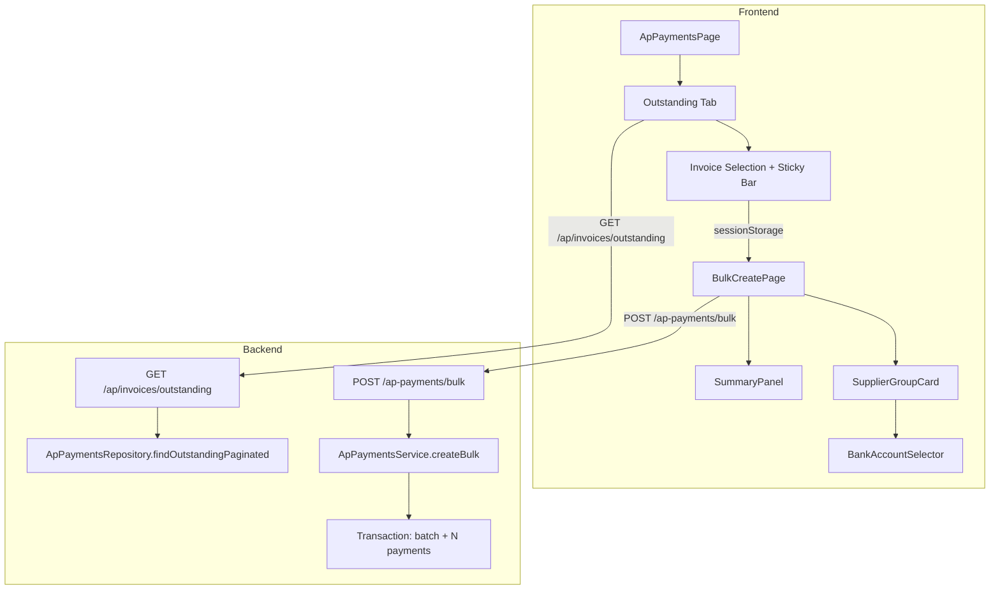
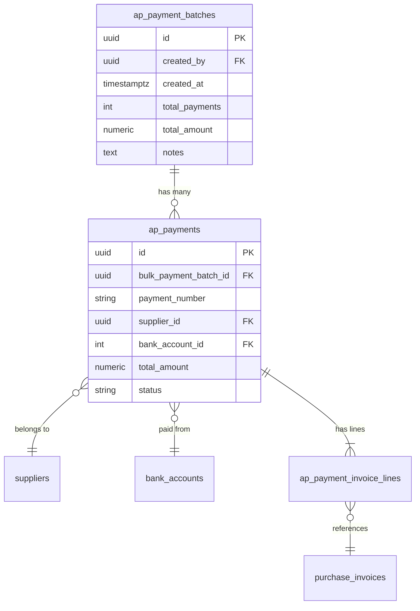

# Design Document: AP Bulk Payments

## Overview

This design extends the existing AP Payments module with bulk payment capabilities. The feature allows finance users to select multiple outstanding invoices from a dedicated tab, group them by supplier, assign company bank accounts, and submit a batch payment request that creates multiple AP payment records in a single transaction.

The design builds on the existing `ap-payments` module infrastructure (routes, service, repository pattern) and the `urlFilters` library already used for URL-persisted filter state. New components include a paginated Outstanding Invoices tab, a Bulk Create page with supplier grouping, a Summary Panel, and a backend bulk submission endpoint backed by a new `ap_payment_batches` table.

### Key Design Decisions

1. **URL filter state via existing `useUrlFilters` hook** — The AP Payments page already uses `useUrlFilters` with `useApPaymentFilters`. We extend the existing filter types to include `dateFrom`, `dateTo`, and `bulkOnly` fields. No migration from `useState` to `useSearchParams` is needed since the infrastructure is already in place.

2. **Session storage for cross-page invoice selection** — Selected invoice IDs are passed from the Outstanding tab to the Bulk Create page via `sessionStorage` rather than URL params (to avoid URL length limits with up to 50 UUIDs) or global state (which would be lost on refresh).

3. **Single transaction for bulk creation** — The backend creates one `ap_payment_batches` record and N `ap_payments` records within a single PostgreSQL transaction, ensuring atomicity.

4. **Permission-gated balance visibility** — Bank account balances are conditionally displayed based on the `('bank_accounts', 'view_balance')` permission, checked on the frontend via `usePermissionStore`.

## Architecture



### Data Flow

1. **Outstanding Tab** → User selects invoices → IDs stored in `sessionStorage`
2. **Bulk Create Page** → Reads IDs from `sessionStorage` → Fetches invoice details via API
3. **Supplier Grouping** → Invoices grouped by `supplier_id`, sorted alphabetically
4. **Bank Assignment** → User assigns company bank accounts per invoice or per group
5. **Submission** → Frontend groups by `(supplier_id, bank_account_id)` → POST to `/ap-payments/bulk`
6. **Backend** → Validates invoices → Creates batch record + individual payments in transaction

## Components and Interfaces

### Frontend Components

#### 1. Extended `ApPaymentsPage` (modified)

- Add `dateFrom`/`dateTo` filter inputs to the filter row
- Add "Export" button to header
- Add "Invoice Outstanding" tab to tab bar
- Add "Bulk only" toggle filter
- Display bulk badge on payments with `bulk_payment_batch_id`

#### 2. `OutstandingInvoicesTab` (new component)

```typescript
interface OutstandingInvoicesTabProps {
  filters: ApPaymentFilters
}
```

- Paginated table with checkboxes
- Aging badge per invoice row
- Sticky action bar when selections exist
- Max 50 invoice selection limit
- Cross-page selection persistence via React state (not URL)

#### 3. `BulkCreatePage` (new page)

```typescript
// Route: /finance/ap-payments/bulk-create
// Permission: ap_payments (view)
```

- Two-column layout (md+ breakpoint): left = supplier groups, right = summary panel
- Reads invoice IDs from `sessionStorage('bulk_selected_invoices')`
- Redirects to `/finance/ap-payments` if no IDs found

#### 4. `SupplierGroupCard` (new component)

```typescript
interface SupplierGroupCardProps {
  supplier: {
    id: string
    name: string
    bankAccounts: Array<{ bank_name: string; account_number: string }>
  }
  invoices: OutstandingInvoiceRow[]
  companyBankAccounts: CompanyBankAccount[]
  canViewBalance: boolean
  groupNotes: string
  onGroupNotesChange: (notes: string) => void
  onApplyAll: (bankAccountId: number) => void
  onInvoiceToggle: (invoiceId: string, checked: boolean) => void
  onBankAccountChange: (invoiceId: string, bankAccountId: number | null) => void
}
```

#### 5. `BankAccountSelector` (new component)

```typescript
interface BankAccountSelectorProps {
  accounts: CompanyBankAccount[]
  value: number | null
  onChange: (id: number | null) => void
  disabled?: boolean
  canViewBalance: boolean
  totalAssigned?: number // for sufficiency indicator
  error?: boolean
}
```

#### 6. `SummaryPanel` (new component)

```typescript
interface SummaryPanelProps {
  supplierCount: number
  invoiceCount: number
  grandTotal: number
  paymentCount: number // unique (supplier_id, bank_account_id) combos
  bankAccountUsage: Array<{
    id: number
    bank_name: string
    account_number: string
    usedAmount: number
    balance?: number // only if canViewBalance
  }>
  canViewBalance: boolean
  hasInsufficientBalance: boolean
  onSubmit: () => void
  isSubmitting: boolean
}
```

#### 7. `AgingBadge` (new component)

```typescript
interface AgingBadgeProps {
  dueDate: string | null
  // Renders: red (overdue), amber (≤7 days), gray (>7 days)
}
```

#### 8. `BulkBadge` (new component)

```typescript
interface BulkBadgeProps {
  batchId: string // displays first 4 chars
}
// Styling: bg-violet-100 text-violet-700 / dark: bg-violet-900/30 text-violet-300
```

### Frontend Hooks

#### `useBulkCreateState` (new hook)

Manages the bulk create page state using Zustand or local `useReducer`:

```typescript
interface BulkCreateState {
  invoices: Map<string, InvoiceAssignment> // invoiceId → assignment
  groupNotes: Map<string, string> // supplierId → notes
  // Derived
  checkedInvoices: InvoiceAssignment[]
  supplierGroups: SupplierGroup[]
  bankAccountUsage: BankAccountUsage[]
  grandTotal: number
  paymentCount: number
}

interface InvoiceAssignment {
  invoiceId: string
  supplierId: string
  supplierName: string
  invoiceNumber: string
  remainingAmount: number
  dueDate: string | null
  checked: boolean
  bankAccountId: number | null
}
```

#### `useOutstandingInvoicesPaginated` (new hook)

```typescript
// Wraps TanStack Query for the paginated outstanding invoices endpoint
function useOutstandingInvoicesPaginated(params: OutstandingInvoicesQuery)
```

#### `useCompanyBankAccounts` (new hook)

```typescript
// Fetches company bank accounts with optional balance (if permitted)
function useCompanyBankAccounts(options?: { includeBalance?: boolean })
```

### Backend Interfaces

#### New Route: `POST /ap-payments/bulk`

```typescript
// Request body
interface BulkCreateApPaymentDto {
  batch_notes?: string | null  // max 500 chars
  payments: Array<{
    supplier_id: string
    bank_account_id: number
    payment_method: ApPaymentMethod // default TRANSFER
    invoice_lines: Array<{
      purchase_invoice_id: string
      amount_paid: number
    }>
    notes?: string | null // from supplier group notes
  }>
}

// Response
interface BulkCreateApPaymentResponse {
  batch_id: string
  total_payments: number
  total_amount: number
  payments: Array<{
    id: string
    payment_number: string
    supplier_name: string
    total_amount: number
  }>
}
```

#### Enhanced Route: `GET /ap-payments/outstanding-invoices`

Extended with pagination, search, and date filtering:

```typescript
// Query params
interface OutstandingInvoicesQuery {
  supplier_id?: string   // UUID
  branch_id?: string     // UUID
  date_from?: string     // ISO date, filters invoice_date
  date_to?: string       // ISO date, filters invoice_date
  search?: string        // max 100 chars, matches invoice_number + supplier_name
  page?: number          // default 1, min 1
  limit?: number         // default 20, min 1, max 100
}

// Response item
interface OutstandingInvoiceRow {
  id: string
  invoice_number: string
  invoice_date: string
  supplier_id: string
  supplier_name: string
  branch_id: string
  branch_name: string
  total_amount: number
  remaining_amount: number
  due_date: string | null
  aging_days: number | null  // positive = overdue, negative = days until due
  invoice_status: 'APPROVED' | 'POSTED'
  supplier_bank_accounts: Array<{
    bank_name: string
    account_number: string
  }>
}

// Paginated response
interface OutstandingInvoicesResponse {
  data: OutstandingInvoiceRow[]
  pagination: {
    page: number
    limit: number
    total: number
    totalPages: number
  }
}
```

#### Enhanced Route: `GET /ap-payments`

Add `bulk_only` query parameter and return `bulk_payment_batch_id` in response.

### Backend Service Methods

```typescript
// New methods on ApPaymentsService
class ApPaymentsService {
  async createBulk(
    dto: BulkCreateApPaymentDto,
    companyId: string,
    contextBranchId: string,
    userId: string,
  ): Promise<BulkCreateApPaymentResponse>

  async getOutstandingInvoicesPaginated(
    companyId: string,
    query: OutstandingInvoicesQuery,
    branchIds?: string[],
  ): Promise<{ data: OutstandingInvoiceRow[]; total: number }>
}
```

## Data Models

### New Table: `ap_payment_batches`

```sql
CREATE TABLE ap_payment_batches (
  id            UUID PRIMARY KEY DEFAULT gen_random_uuid(),
  created_by    UUID NOT NULL REFERENCES auth_users(id),
  created_at    TIMESTAMPTZ NOT NULL DEFAULT now(),
  total_payments INTEGER NOT NULL CHECK (total_payments > 0),
  total_amount  NUMERIC(15,2) NOT NULL CHECK (total_amount > 0),
  notes         TEXT
);

CREATE INDEX idx_ap_payment_batches_created_by
  ON ap_payment_batches(created_by);
```

### Modified Table: `ap_payments`

```sql
ALTER TABLE ap_payments
  ADD COLUMN bulk_payment_batch_id UUID
    REFERENCES ap_payment_batches(id) ON DELETE SET NULL;

CREATE INDEX idx_ap_payments_bulk_batch
  ON ap_payments(bulk_payment_batch_id)
  WHERE bulk_payment_batch_id IS NOT NULL;
```

### New Permission Entry

```sql
INSERT INTO permissions (module, action, description)
VALUES ('bank_accounts', 'view_balance', 'View bank account balance amounts')
ON CONFLICT DO NOTHING;
```

### Entity Relationships



### Frontend State Model

```typescript
// Bulk Create page local state (useReducer or Zustand slice)
interface BulkCreateFormState {
  // Source data (from API)
  invoices: OutstandingInvoiceRow[]
  companyBankAccounts: CompanyBankAccount[]

  // User selections
  assignments: Map<string, {
    checked: boolean
    bankAccountId: number | null
  }>
  groupNotes: Map<string, string> // supplierId → notes

  // UI state
  validationErrors: Set<string> // invoice IDs with missing bank account
  isSubmitting: boolean
}
```

## Correctness Properties

*A property is a characteristic or behavior that should hold true across all valid executions of a system — essentially, a formal statement about what the system should do. Properties serve as the bridge between human-readable specifications and machine-verifiable correctness guarantees.*

### Property 1: URL filter round-trip preservation

*For any* valid combination of filter values (tab, status, supplierId, branchId, paymentMethod, search, page, limit, dateFrom, dateTo), serializing the filters to URL search parameters and then parsing them back SHALL produce an equivalent filter state.

**Validates: Requirements 1.1, 1.2, 1.3**

### Property 2: Default filter omission

*For any* filter state where one or more values equal their defaults, the serialized URL string SHALL NOT contain parameters for those default values, and parsing the resulting URL SHALL restore the full filter state with defaults applied.

**Validates: Requirements 1.4**

### Property 3: Page reset on filter change

*For any* filter state with page > 1, changing any result-affecting filter (search, status, supplierId, branchId, paymentMethod, tab, dateFrom, dateTo, limit) SHALL produce a new filter state with page = 1.

**Validates: Requirements 1.5**

### Property 4: Invalid URL parameter fallback

*For any* URL search parameter string containing invalid values (non-positive page, limit outside 1–100, unrecognized status or tab), parsing SHALL produce a filter state where each invalid parameter is replaced by its default value.

**Validates: Requirements 1.6**

### Property 5: Date range validation

*For any* pair of date strings (dateFrom, dateTo) where dateFrom is chronologically after dateTo, the validation function SHALL return an error and the API query SHALL NOT be constructed.

**Validates: Requirements 2.5**

### Property 6: Aging badge classification

*For any* due date value, the aging badge color SHALL be: red when due_date < today, amber when due_date is today or within the next 7 calendar days (inclusive), and gray when due_date is more than 7 days from today.

**Validates: Requirements 4.4**

### Property 7: Selection count invariant

*For any* set of checked invoices across multiple pages, the sticky action bar total SHALL equal the sum of `remaining_amount` for all checked invoices, and the count SHALL equal the number of checked invoices.

**Validates: Requirements 4.6, 4.9**

### Property 8: Supplier grouping completeness

*For any* set of selected invoices, grouping by supplier_id SHALL produce groups where the union of all invoices across all groups equals the original set, with no duplicates and no omissions.

**Validates: Requirements 5.6**

### Property 9: Apply-all bank account propagation

*For any* supplier group with N checked invoices, applying a bank account via "Apply to all" SHALL set that bank account on exactly the N checked invoices in that group, leaving unchecked invoices with null bank account.

**Validates: Requirements 6.4**

### Property 10: Payment count calculation

*For any* set of checked invoices with bank accounts assigned, the payment count (displayed on the submit button) SHALL equal the number of distinct `(supplier_id, bank_account_id)` combinations among checked invoices.

**Validates: Requirements 8.7**

### Property 11: Bulk submission payload grouping

*For any* valid set of invoice assignments, the bulk payment payload SHALL group invoices into payment objects by unique `(supplier_id, bank_account_id)` pairs, where each payment's `total_amount` equals the sum of its invoice line `amount_paid` values.

**Validates: Requirements 9.4**

### Property 12: Bulk creation atomicity

*For any* valid bulk payment request with N payment groups, the backend SHALL create exactly 1 batch record and N payment records, all within a single transaction. If any validation fails, zero records SHALL be created.

**Validates: Requirements 9.5**

### Property 13: Bank account usage aggregation

*For any* set of invoice assignments, the summary panel's bank account usage SHALL show each assigned bank account exactly once with a `usedAmount` equal to the sum of `remaining_amount` for all invoices assigned to that account.

**Validates: Requirements 8.2, 8.3**

## Error Handling

### Frontend Errors

| Scenario | Handling |
|----------|----------|
| Outstanding invoices API fails | Show error state with retry button in tab |
| Bank accounts API fails | Disable all selectors, show error message |
| Bulk create — no IDs in sessionStorage | Redirect to `/finance/ap-payments` |
| Bulk create — invoice fetch fails | Show error with retry option |
| Validation — missing bank account | Highlight row with `border-red-300 bg-red-50/50`, scroll to first error |
| Validation — insufficient balance | Disable submit button (only when user has `view_balance` permission) |
| Submission — network error | Error toast, retain form state |
| Submission — backend validation error (invalid invoices) | Display error message listing invalid invoice IDs, retain form |
| Export — network error | Error toast, re-enable Export button |
| Export — no data | Disable Export button |
| Date range — dateFrom > dateTo | Inline validation message, block API request |

### Backend Errors

| Scenario | HTTP Status | Error Code |
|----------|-------------|------------|
| Invoice not found | 400 | `AP_BULK_INVOICE_NOT_FOUND` |
| Invoice already paid/reconciled | 400 | `AP_BULK_INVOICE_NOT_ELIGIBLE` |
| Outstanding amount exceeded | 400 | `AP_BULK_OUTSTANDING_EXCEEDED` |
| Empty payments array | 400 | `AP_BULK_EMPTY_PAYMENTS` |
| Batch notes exceeds 500 chars | 400 | `VALIDATION_ERROR` |
| Transaction failure | 500 | `INTERNAL_ERROR` |

### Error Classes (new)

```typescript
// backend/src/modules/ap-payments/ap-payments.errors.ts (additions)
class ApBulkInvoiceNotFoundError extends AppError { ... }
class ApBulkInvoiceNotEligibleError extends AppError { ... }
class ApBulkOutstandingExceededError extends AppError { ... }
class ApBulkEmptyPaymentsError extends AppError { ... }
```

## Testing Strategy

### Unit Tests (Example-Based)

- **URL filter serialization/parsing**: Specific examples for each filter field, edge cases (empty strings, boundary values)
- **Date range validation**: Specific date pairs (valid, invalid, single-sided)
- **Aging badge rendering**: Specific dates relative to today (yesterday, today, +7, +8)
- **Export filename generation**: Verify date format in filename
- **Bulk badge rendering**: Verify first-4-chars truncation
- **Permission gating**: Verify balance visibility with/without permission

### Property-Based Tests

Property-based testing is appropriate for this feature because it involves:
- Pure filter serialization/parsing functions with a large input space
- Grouping/aggregation logic with universal invariants
- Validation logic that should hold across all inputs

**Library**: `fast-check` (already available in the project's test infrastructure or easily added)

**Configuration**: Minimum 100 iterations per property test.

Each property test references its design document property:
- **Feature: ap-bulk-payments, Property 1**: URL filter round-trip
- **Feature: ap-bulk-payments, Property 2**: Default filter omission
- **Feature: ap-bulk-payments, Property 3**: Page reset on filter change
- **Feature: ap-bulk-payments, Property 4**: Invalid URL parameter fallback
- **Feature: ap-bulk-payments, Property 5**: Date range validation
- **Feature: ap-bulk-payments, Property 6**: Aging badge classification
- **Feature: ap-bulk-payments, Property 7**: Selection count invariant
- **Feature: ap-bulk-payments, Property 8**: Supplier grouping completeness
- **Feature: ap-bulk-payments, Property 9**: Apply-all propagation
- **Feature: ap-bulk-payments, Property 10**: Payment count calculation
- **Feature: ap-bulk-payments, Property 11**: Bulk submission payload grouping
- **Feature: ap-bulk-payments, Property 12**: Bulk creation atomicity
- **Feature: ap-bulk-payments, Property 13**: Bank account usage aggregation

### Integration Tests

- **Outstanding invoices endpoint**: Verify filtering, pagination, aging_days calculation
- **Bulk payment endpoint**: Verify transaction atomicity, payment number generation, batch linkage
- **List endpoint with bulk_only filter**: Verify filtering by `bulk_payment_batch_id`
- **Permission check**: Verify `view_balance` permission enforcement

### E2E Tests (Manual/Cypress)

- Full flow: Outstanding tab → select invoices → bulk create → assign accounts → submit → verify in list
- Permission scenarios: with/without `view_balance`
- Edge cases: max 50 selection, cross-page selection persistence
