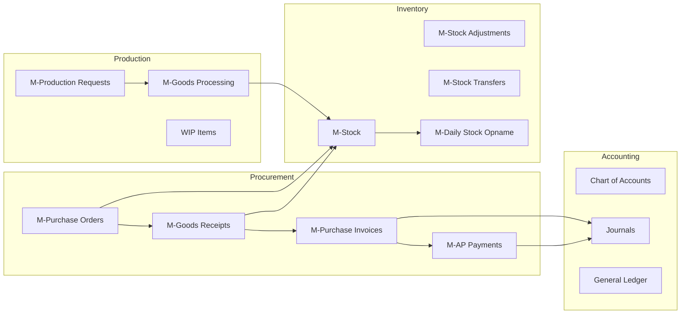

# Suryamas Brain 🧠

> System documentation for Suryamas ERP. Modules: 60+ | Last rebuilt: 2026-06-08

---

## Quick Links

| Area | Description |
|------|-------------|
| [[Module-Catalog\|📦 Module Catalog]] | All 60+ backend modules |
| [[System-Map.canvas\|🗺️ System Map]] | Visual module relationships |
| [[20-DOMAINS/Purchasing/_Index\|📥 Purchasing]] | PO → GR → PI → AP Payment |
| [[20-DOMAINS/Accounting/_Index\|💰 Accounting]] | COA → Journal → GL → Reports |
| [[20-DOMAINS/Inventory/_Index\|📦 Inventory]] | Stock → Adjustment → Transfer |
| [[40-DATABASE/_Index\|🗄️ Database]] | Tables, ERD, Migrations |
| [[70-FLOWS/PO-to-Payment\|🔀 Flows]] | Cross-module business flows |
| [[80-RUNBOOKS/Debugging-Tips\|🔧 Runbooks]] | Debugging & operations |

---

## Domain Map



---

## Module Status Overview

```dataview
TABLE slug, status, depends_on, last_updated as "Last Updated"
FROM "30-MODULES"
WHERE type = "module"
SORT status ASC, slug ASC
```

## Stale Watch

```dataview
TABLE file.mtime as "File Modified", last_updated as "Frontmatter Updated"
FROM "30-MODULES"
WHERE last_updated AND date(today) - date(last_updated) > duration("90 days")
SORT last_updated ASC
```

## Recent Changes

```dataview
TABLE last_updated, status
FROM "30-MODULES"
WHERE last_updated
SORT last_updated DESC
LIMIT 10