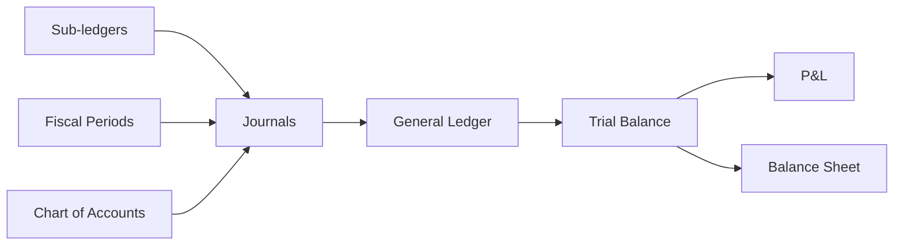

# Accounting Domain

> Chart of Accounts → Journal → General Ledger → Reports (TB, P&L, Balance Sheet)

## Modules

```dataview
TABLE slug, status, api_base, last_updated
FROM "30-MODULES"
WHERE domain = link([[20-DOMAINS/Accounting/_Index]])
SORT slug ASC
```

## Flow Diagram



## Related Domains

- [[20-DOMAINS/Purchasing/_Index|Purchasing]] — PI and AP post journals
- [[20-DOMAINS/Inventory/_Index|Inventory]] — Stock adjustments post journals