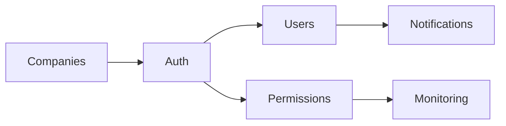

# Auth Domain

> Authentication → Authorization → Users → Permissions → Notifications

## Modules

```dataview
TABLE slug, status, api_base, last_updated
FROM "30-MODULES"
WHERE domain = link([[20-DOMAINS/Auth/_Index]])
SORT slug ASC
```

## Flow Diagram



## Related Domains
- All domains — every module uses `authenticate` + `canView`/`canInsert` middleware