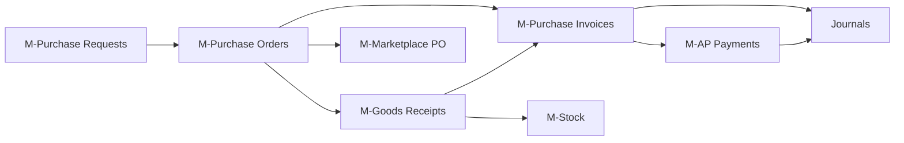

# Purchasing Domain

> Procurement flow: Purchase Request → Purchase Order → Goods Receipt → Purchase Invoice → AP Payment

## Modules

```dataview
TABLE slug, status, api_base, last_updated
FROM "30-MODULES"
WHERE domain = link([[20-DOMAINS/Purchasing/_Index]])
SORT slug ASC
```

## Flow Diagram



## Key Business Flows

- [[70-FLOWS/PO-to-Payment|PO to Payment]]
- [[50-API/Marketplace-PO]]

## Core Tables

| Table | Module | Purpose |
|-------|--------|---------|
| `purchase_orders` | M-Purchase Orders | Header of PO |
| `purchase_order_lines` | M-Purchase Orders | Line items |
| `goods_receipts` | M-Goods Receipts | Receiving |
| `purchase_invoices` | M-Purchase Invoices | Supplier invoice |
| `ap_payments` | M-AP Payments | Payment to supplier |
| `suppliers` | M-Suppliers | Vendor master |
| `supplier_products` | M-Supplier Products | Vendor-product mapping |

## Cross-Cutting Concerns

| Concern | Applies To |
|---------|------------|
| Tax calculation | PI lines |
| Payment terms | PO, PI |
| Multi-currency | PI (via supplier) |
| Fiscal period check | PI posting, AP payment |
| Audit trail | All |

## Related Domains

- [[20-DOMAINS/Accounting/_Index|Accounting]] — PI and AP post journals
- [[20-DOMAINS/Inventory/_Index|Inventory]] — GR updates stock