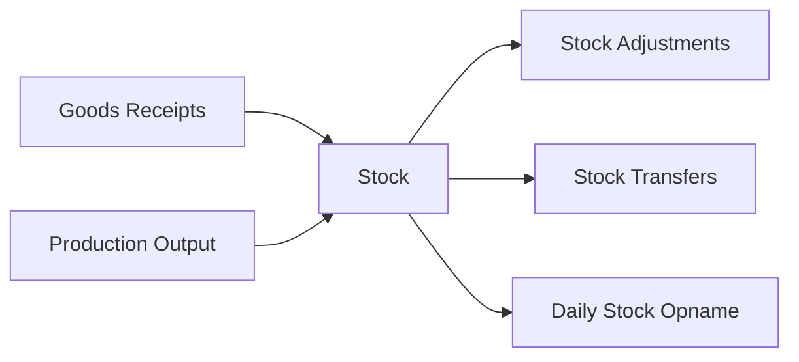

# Inventory Domain

> Product master → Stock → Warehouse → Adjustments → Opname → Transfer

## Modules

```dataview
TABLE slug, status, api_base, last_updated
FROM "30-MODULES"
WHERE domain = link([[20-DOMAINS/Inventory/_Index]])
SORT slug ASC
```

## Flow Diagram



## Related Domains

- [[20-DOMAINS/Purchasing/_Index|Purchasing]] — GR updates stock
- [[20-DOMAINS/Production/_Index|Production]] — Output updates stock