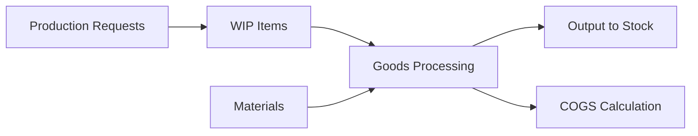

# Production Domain

> Production Request → WIP → Goods Processing → Output → COGS

## Modules

```dataview
TABLE slug, status, api_base, last_updated
FROM "30-MODULES"
WHERE domain = link([[20-DOMAINS/Production/_Index]])
SORT slug ASC
```

## Flow Diagram



## Related Domains

- [[20-DOMAINS/Inventory/_Index|Inventory]] — Output updates stock
- [[20-DOMAINS/Accounting/_Index|Accounting]] — COGS posts journals