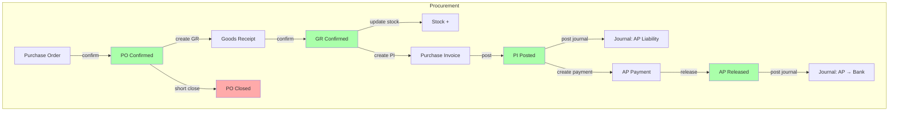

# PO to Payment

## Flow Diagram

## Status Chain

| Module | Status | Next | Condition |
|--------|--------|------|-----------|
| Purchase Orders | `draft` | `confirmed` | Supplier confirmed, fiscal period open |
| Purchase Orders | `confirmed` | `closed` (short close) | All lines fulfilled OR manual close |
| Goods Receipts | `draft` | `confirmed` | Stock updated, PO lines remaining_qty decremented |
| Goods Receipts | `confirmed` | `unconfirm` (reverse) | Only if no PI linked yet |
| Purchase Invoices | `draft` | `posted` | GL posting complete |
| Purchase Invoices | `posted` | `void` | Reversal journal created |
| AP Payments | `draft` | `approved` | Internal approval |
| AP Payments | `approved` | `released` | Bank transfer completed |

## Module Involvement

| Module | Role | Key Endpoints |
|--------|------|---------------|
| [[30-MODULES/M-purchase-orders\|Purchase Orders]] | Create and manage PO | `POST /api/v1/purchase-orders`, `POST .../confirm` |
| [[30-MODULES/M-goods-receipts\|Goods Receipts]] | Record incoming goods | `POST .../goods-receipts`, `POST .../confirm` |
| [[30-MODULES/M-purchase-invoices\|Purchase Invoices]] | Supplier invoice processing | `POST .../purchase-invoices`, `POST .../post` |
| [[30-MODULES/M-ap-payments\|AP Payments]] | Payment to supplier | `POST .../ap-payments`, `POST .../release` |
| [[30-MODULES/M-accounting\|Accounting]] | Journal posting | Auto on PI post and AP release |

## Audit Trail

| Action | Table | Before | After |
|--------|-------|--------|-------|
| PO confirm | purchase_orders | status=draft | status=confirmed |
| GR confirm | goods_receipts | status=draft | status=confirmed |
| PO line remaining | purchase_order_lines | remaining_qty=X | remaining_qty=Y |
| PI post | purchase_invoices | status=draft | status=posted |
| Journal header | journal_headers | - | journal created |
| AP release | ap_payments | status=approved | status=released |

## Common Debugging Scenarios

| Symptom | Likely Root Cause | Check |
|---------|-------------------|-------|
| Cannot confirm PO | Fiscal period closed | `requireWriteAccess` middleware |
| GR not updating stock | GR still in draft | Status check in GR service |
| PI cannot link GR | GR not confirmed yet | GR status filter |
| PI post fails | COA not mapped for this supplier | COA mapping in `general_ap_expense_coa_defaults` |
| AP release fails | Bank account not assigned to PI | `pi_assigned_bank_account` |
| Journal double posting | No idempotency check | Fiscal period + journal header dedup |

## Related Data Models

- [[40-DATABASE/Tables/T-purchase-orders]]
- [[40-DATABASE/Tables/T-purchase-order-lines]]
- [[40-DATABASE/Tables/T-goods-receipts]]
- [[40-DATABASE/Tables/T-purchase-invoices]]
- [[40-DATABASE/Tables/T-ap-payments]]