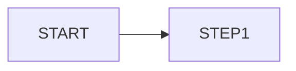

# {{title}}

## Flow Diagram

## Status Chain

| Status | Description | Next Status | Conditions |
|--------|-------------|-------------|------------|
| | | | |

## Module Involvement

| Module | Role | Key Endpoint |
|--------|------|-------------|
| [[30-MODULES/M-|Module]] | | |

## Audit Trail (What Gets Logged)

- 

## Common Debugging Scenarios

- 

## Related
- [[_Data-Model]]