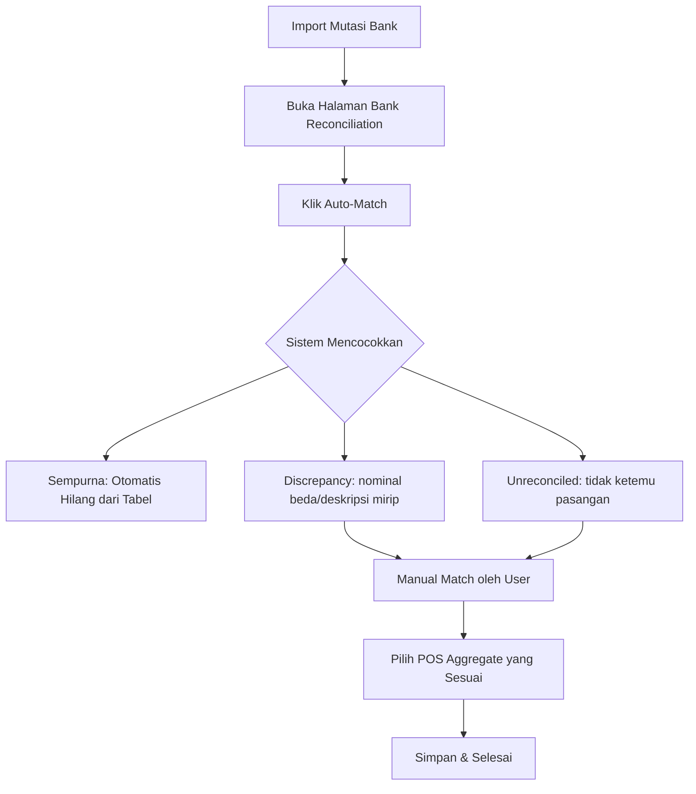

# Panduan Fitur Bank Reconciliation (Frontend)

Fitur Bank Reconciliation dirancang untuk mencocokkan mutasi bank yang telah diimpor dengan data transaksi dari POS (Point of Sale). Modul ini membantu bagian accounting untuk memverifikasi bahwa uang yang masuk ke bank sesuai dengan laporan penjualan.

## Arsitektur Folder

Fitur ini terletak di `frontend/src/features/bank-reconciliation/` dengan struktur sebagai berikut:

```text
bank-reconciliation/
├── api/          # Definisi API calls (Axios)
├── components/   # UI Components khusus (tabel, modal, cards)
├── hooks/        # Custom react hook untuk logic & state
├── pages/        # Entry point page (BankReconciliationPage)
└── types/        # Definisi TypeScript interfaces
```

## Komponen Utama

### 1. `BankReconciliationPage`

Halaman utama yang mengintegrasikan semua komponen. Halaman ini mengatur:

- Pemilihan rentang tanggal.
- Pengambilan data awal (summary dan daftar discrepancy).
- Penanganan event dari modal dan tabel.

### 2. `ReconciliationSummaryCards`

Menampilkan kartu ringkasan di bagian atas halaman:

- **Total Statements**: Jumlah mutasi bank dalam periode tersebut.
- **Terekonsiliasi**: Persentase mutasi yang sudah dipasangkan.
- **Discrepancies**: Jumlah transaksi yang memiliki selisih nominal.
- **Belum Cocok**: Transaksi yang belum dipasangkan sama sekali.

### 3. `DiscrepancyTable`

Tabel utama yang menunjukkan mutasi bank yang membutuhkan perhatian:

- Menampilkan detail mutasi (tanggal, deskripsi, nominal).
- Menampilkan data POS yang sudah "auto-matched" (jika ada) beserta selisihnya.
- Aksi: **Manual Match** (untuk mencari pasangan manual) dan **Undo** (untuk membatalkan pasangan).

### 4. `AutoMatchDialog` & `ManualMatchModal`

- **AutoMatchDialog**: Menjalankan algoritma pencocokan otomatis di server untuk semua data dalam rentang tanggal.
- **ManualMatchModal**: Memungkinkan pengguna mencari dan memilih `POS Aggregate` secara manual untuk dipasangkan dengan mutasi bank tertentu.

## State Management (`useBankReconciliation`)

Logic aplikasi dipisahkan ke dalam custom hook `useBankReconciliation`. Hook ini menyediakan:

| State/Method           | Deskripsi                                                   |
| ---------------------- | ----------------------------------------------------------- |
| `summary`              | Objek ringkasan statistik.                                  |
| `discrepancies`        | Array item mutasi yang belum/salah cocok.                   |
| `fetchSummary()`       | Mengambil data kartu statistik dari API.                    |
| `fetchDiscrepancies()` | Mengambil data tabel dari API.                              |
| `autoMatch()`          | Mengirim request untuk menjalankan auto-matching.           |
| `manualReconcile()`    | Mengirim request untuk memasangkan transaksi secara manual. |

## Alur Kerja (Workflow)



### Tips Penggunaan

- **Range Tanggal**: Pastikan rentang tanggal mencakup tanggal transaksi bank dan tanggal settlement POS (biasanya H+1).
- **Threshold**: Saat Manual Match, jika ada selisih kecil (misal: biaya admin bank), user dapat memilih untuk "Override Difference" agar status tetap menjadi Reconciled.
- **Undo**: Jika salah pasangkan transaksi, gunakan tombol Undo di tabel discrepancy untuk memisahkan kembali mutasi bank dari data POS.
